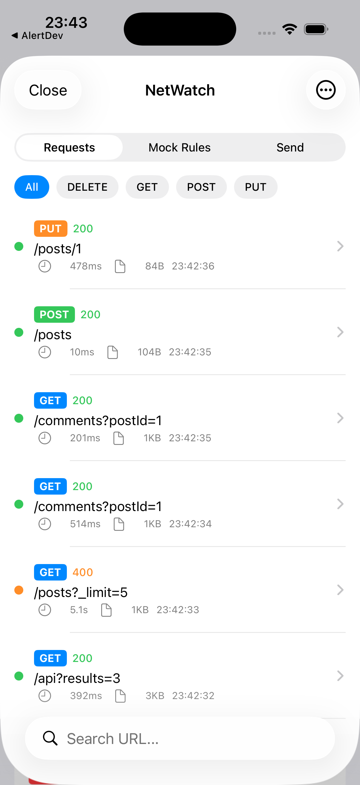
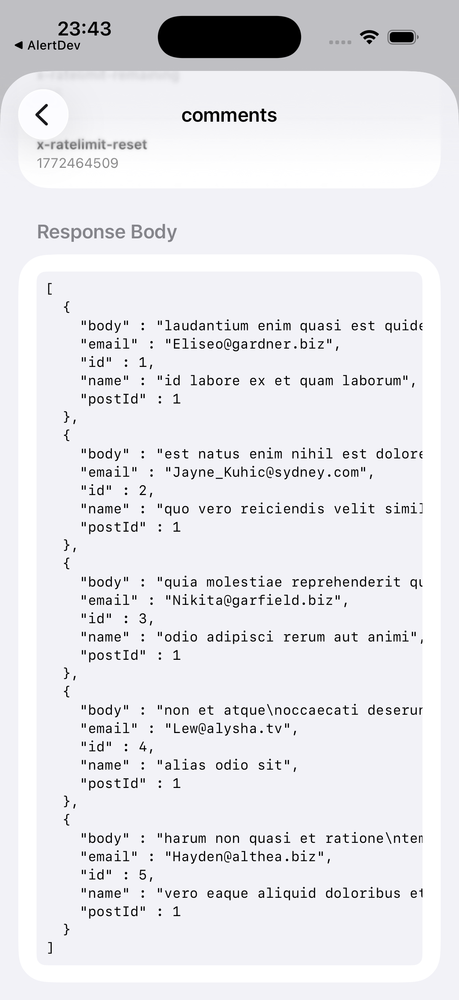
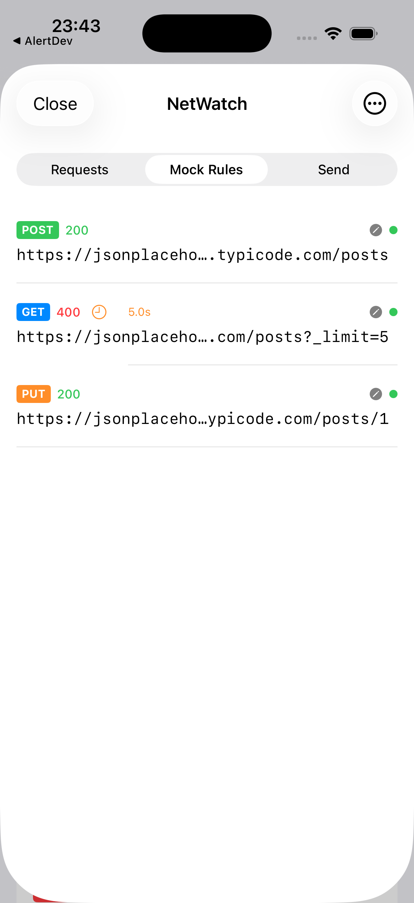
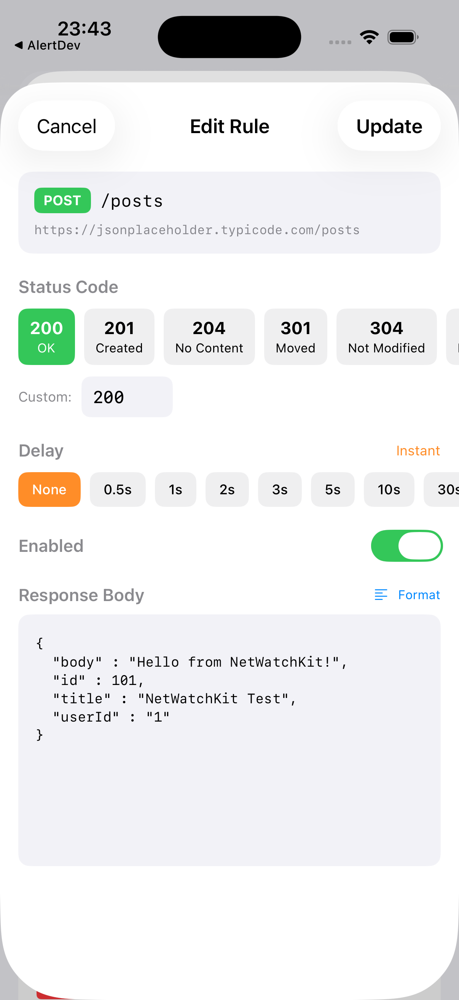
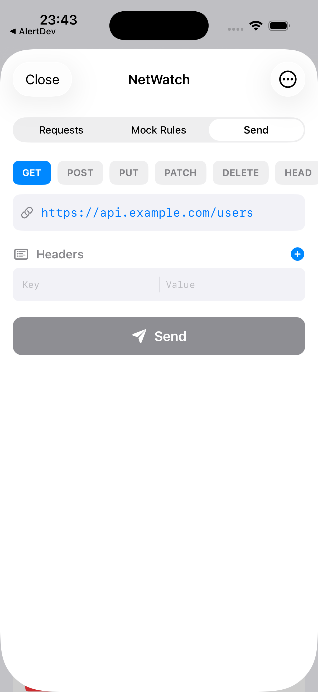

# NetWatchKit

A network debugging and mocking toolkit for iOS. Inspect every request your app makes, mock responses on the fly, and build custom requests — all from an in-app debug panel.

Zero configuration. Drop it in, call `start()`, done.

## What it does

- Intercepts all network traffic transparently (URLProtocol-based)
- Shows a live request log with method, status, duration, and size
- Lets you inspect full request/response details (headers, body, timing)
- Mock any endpoint with custom status codes, headers, body, and delay
- Built-in request builder for manual API testing
- Copy any request as cURL with one tap
- Mock rules persist across app launches
- Debug-only by default — zero footprint in Release builds

## Installation

```swift
dependencies: [
    .package(url: "https://github.com/tahakirca/NetWatchKit.git", from: "1.0.0")
]
```

## Setup

Two lines to get started:

```swift
import SwiftUI
import NetWatchKit

@main
struct MyApp: App {
    init() {
        NetWatch.shared.start()
    }

    var body: some Scene {
        WindowGroup {
            ContentView()
                .netWatch() // Enables the debug panel sheet
        }
    }
}
```

Then place the trigger button somewhere in your UI:

```swift
NetWatchTriggerButton(style: .floating) // .floating | .inline | .minimal
```

That's it. Every network request your app makes will now appear in the debug panel.

### Custom URLSession

If you use a custom `URLSessionConfiguration`, register the interceptor:

```swift
let config = URLSessionConfiguration.default
NetWatch.register(to: config)
let session = URLSession(configuration: config)
```

## Screenshots

<table>
  <tr>
    <td align="center"><br /><b>Request List</b><br />Live feed with method, status,<br />duration, and size</td>
    <td align="center"><br /><b>Response Detail</b><br />Headers and pretty-printed<br />JSON body</td>
    <td align="center"><br /><b>Mock Rules</b><br />Active rules with method,<br />status code, and delay</td>
  </tr>
  <tr>
    <td align="center"><br /><b>Mock Editor</b><br />Status code, delay, and<br />custom response body</td>
    <td align="center"><br /><b>Request Builder</b><br />Manual API testing with<br />method, URL, and headers</td>
    <td></td>
  </tr>
</table>

## Debug Panel

The panel has three tabs:

### Requests
Live feed of all network requests. Each row shows:
- HTTP method (GET, POST, etc.)
- Status code with color coding (green/red)
- Response time and size
- Timestamp

Tap any request to see full details — headers, body (pretty-printed JSON), and a "Copy as cURL" button.

### Mock Rules
Create rules to intercept and mock any endpoint:
- URL pattern matching with wildcards (`/api/users/*`)
- Filter by HTTP method
- Custom status code, headers, and response body
- Configurable delay (simulate slow networks)
- Enable/disable per rule
- Rules persist across app launches

You can also tap "Mock This Request" from any request's detail view to auto-create a rule.

### Request Builder
A built-in HTTP client for manual testing:
- Method selector (GET, POST, PUT, DELETE, PATCH)
- URL, headers, and body input
- Send and view response inline

## Programmatic Mock Rules

```swift
let rule = MockRule(
    urlPattern: "/api/users/*",
    method: "GET",
    statusCode: 200,
    responseBody: """
    [{"id": 1, "name": "Mock User"}]
    """.data(using: .utf8)
)

NetWatch.shared.addMockRule(rule)
```

Manage rules:
```swift
NetWatch.shared.activeMockRules    // Currently enabled rules
NetWatch.shared.allMockRules       // All rules
NetWatch.shared.removeMockRule(id: rule.id)
NetWatch.shared.clearMockRules()
```

## Trigger Button Styles

```swift
// Floating blue circle (default)
NetWatchTriggerButton(style: .floating)

// Label with icon
NetWatchTriggerButton(style: .inline)

// Small icon only
NetWatchTriggerButton(style: .minimal)
```

Or skip the button entirely and call `NetWatch.shared.show()` from anywhere:

```swift
Button("Debug") {
    NetWatch.shared.show()
}
.netWatch()
```

## Production Use

By default, NetWatchKit only activates in `DEBUG` builds. To enable in production (e.g. for internal beta testers):

```swift
NetWatch.shared.start(forceEnabled: true)
```

## API Reference

| Method | Description |
|---|---|
| `NetWatch.shared.start()` | Start intercepting (Debug only) |
| `NetWatch.shared.start(forceEnabled: true)` | Start intercepting (any build) |
| `NetWatch.shared.stop()` | Stop intercepting |
| `NetWatch.shared.show()` | Open debug panel |
| `NetWatch.shared.hide()` | Close debug panel |
| `NetWatch.shared.clearRecords()` | Clear request history |
| `NetWatch.shared.addMockRule(_:)` | Add a mock rule |
| `NetWatch.shared.removeMockRule(id:)` | Remove a mock rule |
| `NetWatch.shared.clearMockRules()` | Remove all mock rules |
| `NetWatch.register(to:)` | Register interceptor to custom URLSession config |
| `.netWatch()` | View modifier — attach to root view for sheet support |

## Architecture

```
┌──────────────────────────────────────────┐
│              NetWatch (singleton)         │
│  start/stop, show/hide, mock rules       │
└──────┬───────────────────┬───────────────┘
       │                   │
┌──────▼──────┐    ┌───────▼───────┐
│ Interceptor │    │      UI       │
│ URLProtocol │    │  Dashboard    │
│ captures &  │    │  MockEditor   │
│ mocks traffic│   │  RequestBuilder│
└──────┬──────┘    └───────────────┘
       │
┌──────▼──────┐
│   Storage   │
│  persists   │
│  rules &    │
│  patterns   │
└─────────────┘
```

## Requirements

- iOS 17+
- Swift 6.0+
- Xcode 16+

## License

MIT
